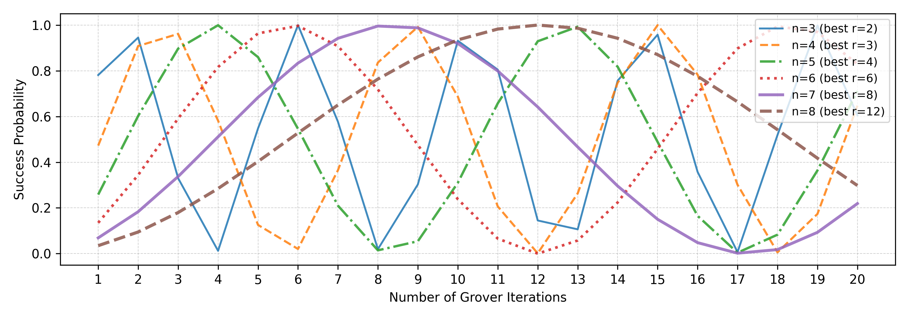
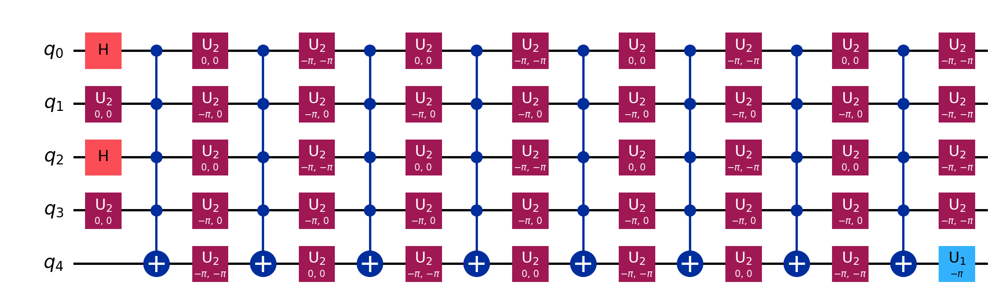

# Grover Multi-Qubit Search Experiments



This project contains adaptive Grover search experiments for 3 to 8 qubit systems, using manually constructed oracles targeting specific bitstrings. 

**IMPORTANT !!!**  Virtual environment needs to be configured under Python 3.11 to run.

## 📁 Structure

```
grover_experiments/
├── grover_test_3bit.py
├── grover_test_4bit.py
├── grover_test_5bit.py
├── ...
├── results/               ← Stores .pdf files of probability data
├── success_rates_xbit.py  ← Merges and plots all success curves
├── requirements.txt       ← Python dependencies
└── README.md              ← This guide
```

## ✅ Features

- Custom Grover oracles for specific target bitstrings  
- Adaptive iteration stopping based on success threshold  
- Both experimental and theoretical success curves  
- Aggregated visual comparison for multiple bit lengths  

## 📈 Output

- Individual measurement distributions (using `plot_distribution`)
- Experimental vs theoretical success probability curves
- Combined plot for 3–8 qubit experiments
- Circuit diagram for 3–8 qubit experiments

### 🔍 Example: Grover Circuit Diagram
Below is an example of an optimized 5-qubit Grover circuit generated from the `grover_test_5bit.py` run:



## 🚀 How to Run

1. **Install dependencies:**

```bash
pip install -r requirements.txt
```

2. **Run an individual test:**

```bash
python grover_test_5bit.py
```

3. **Plot results for all qubit lengths:**

```bash
python success_rates_xbit.py
```

## 🧠 Notes

- Requires Qiskit Aer backend (simulator) and Qiskit Algorithms module.
- `target_state` in each script can be changed freely (match bit length).
